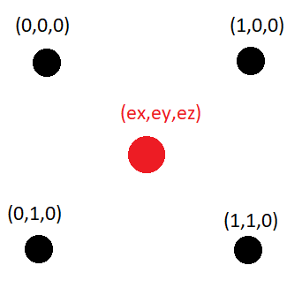

[//]: <> (you can convert this file to pdf or html with)
[//]: <> (pandoc dc-geolocation-intro.md -o dc-geolocation-intro.pdf)
[//]: <> (pandoc --mathml dc-geolocation-intro.md -o dc-geolocation-intro.html)
[//]: <> (you can also generate any of the output formats supported)
[//]: <> (by pandoc, such as .html, .tex, and dozens of others)

MURV
===

Introduction
---

This paper is split into three different sections: the process of creating 
MURV, a technical overview of how MURV works, and finally what is left to be 
accomplished with MURV.

The story of MURV (Multilateration Using RSSI Values)
=======

MURV's Goal
---

The goal of MURV is to allow for the tracking and geolocation of wireless 
devices using RSSI(Recieved Signal Strength Indicator) from APs (wireless access points) values.

Initial Idea
---

The story of the creation of MURV is not the story of trying to solve a 
particular problem, but rather the story of evolving interests. During my 
sophomore year, I started messing around with hypo-cycloids and developed a  
<a herf="https://www.desmos.com/calculator/f2owqmikqp">program</a> in an 
online graphing calculator called Desmos to graph them. Following the 
creation of that program I made another program called the <a her="https://
www.desmos.com/calculator/6m3qvvy5kc">bi-cycloid</a>, which drew a point 
based on the distance to points rotating on two different circles. My 
initial idea for my current project was to take the bi-cycloid and expand 
it into the third dimension. I proposed this idea to my mentors about a 
month before the internship started. My mentors Mark Galassi, who is an 
experienced polymath in math and computer science, and Jason Schaefer, who 
is a wizard at networking and communication systems, pushed me towards the  
idea of making a program that could find the location of a point in the real 
world using multilateration. This is a procress that uses the measured 
distance from an unknown point in space to 3 or more known points in space 
in order to locate the unknown point. However, in order to perform 
multilateration we needed a way to obtain the distance between our unknown 
point and our known points. We settled on using RSSI values from APs (more 
commonly known as routers). Although this idea was different from what I 
originally wanted to accomplish, I was still interested in it.

Early Development
-------------------

The early development of this program allowed me to wrap my head around  
multilateration and ideas and concepts behind it. What I initialy developed 
was a crude form of multilateration that relied on exact distance values to 
find an exact solution. This was done by pre-defining every- points' 
location, and measuring their exact distance to the unknown point using the 
distance formula with both points' coordinates. This allowed me to develop a 
mathematical framework to perform the necessary multilateration and 
understand its concepts. Unfortunately, this framework would is to 
mathematically strict to deal with the noise and error of real world 
measurement.

At this point I decided to shift from the mathematical side of the project to the gathering of data. My mentor Jason, lent me four APs to allow me to gather real world data, and to learn more about what steps I would need to take to get my project useable in a real-world setting.

Middle to Late Development
--------------------------

This began my process into researching how to get and log RSSI values. One 
of my first approaches was to get the RSSI value of the mobile device from 
the APs and send it back to perform the multilateration. This proved to be 
harder than expected for me so I decided to log the RSSI value of the APs 
from the mobile device. While I was researching how to do this I found a 
github repository called rssi_module by villagomez that seemed to accomplish the entirety of my project. This was an important point in the development of this project because it presented a way to accomplish my project goal.

I examined the code and started developing my own code to log the RSSI 
values from the APs. I encountered several issues while developing this code 
and getting it to do what I wanted it to do. For example, when I tried 
logging the RSSI values from multiple APs, only the one that I was currently 
connected to updated its RSSI value. As a result, in order to log someone's 
position as they moved around I had to connect to each of the four necessary 
APs before logging the RSSI value. This causes the program to slow down 
dramatically due to the time that it takes to switch networks. I had to find 
a new command that would log the RSSI values even if it wasn't connected to 
that particular network. Jason recommended that I use the command `sudo iw 
dev wlp1s0 scan`. I implemented this command into the code and it worked 
wonderfully. 

Next, I had to log the RSSI values and convert them to distances. 
Fortunately, this didn't take too long, only 2 or 3 days. Unfortunately, it 
was long enough that I didn't have to time to develop a more robust 
multilateration system. Thankfully my mentor Mark Galassi developed one that 
I could use.  


MURV from a technical standpoint
===========================================


Motivation
----------

**MURV**(multilateration using RSSI values) is a program that allows a wireless networking
device to find its own location using the information it can gather
from its network access points. This can be any device that is capable
of performing wireless networking ie. mobile phones and laptops.

Self-location can be used for several important tasks. These tasks
include locating someone in an emergency, navigation within small
areas (think of something like GPS for an apartment building), or
tracking of that device.

The only data self-location needs is the location of four known points
along with their distance to the unknown point. From there, what's
necessary is the mathematical framework to convert that data into our
physical location. To collect this data we obtain the information
using wireless network access points (APs).

This project has produced two things

* A program that collects the "signal strength" from each access
  point, also known as the RSSI value.
* The mathematical framework that turns the needed data into our
  location through the process of multilateration, with a python
  program to accompanies it.

dc-geolocation is written by David Chamberlain
[catmanisacatlord@gmail.com](mailto:catmanisacatlord@gmail.com) of
Santa Fe High School and the Institute for Computing in Research.


Accessing information in a wireless access point
------------------------------------------------

Most people are only familiar with their access point from the
web-based administrative interface that they use to set it up, but one
can also use instructions to automatically get specific information
from them.

To get a feeling for how this works, try the following at the command
line of a GNU/Linux system:

```sudo iw dev wlp1s0 link```

This command will give you some basic information about the wireless
network you are currently connected to, while While this command will
give you all of the information about all of the networks in your
area:

```sudo iw dev wlp1s0 scan```

We use the second command in our program due to this functionality and
then filter away the networks and data we do not want. This leaves us
with the RSSI value along with the SSID for the APs that we
desire. Using the Free-space path loss formula (which determines how a
signal gets quieter as it passes through free space) and rearranging
it, we can achieve a distance in meters using the formula below.

<!--  -->

$$distance(meters) = 10 ^{((27.55 - (20 \times
\log_{10}(frequency(Mhz))) + signalLevel)/20)}$$

or:

$$d = 10 ^{((27.55 - (20 \times \log(f) + S)/20)}$$

where d is the distance measured in meters, f is the frequency in
hertz, and S is the signal level.

Unfortunately, a big problem with using the signal strength with
routers is how messy and scattered the signal can be, if you have that
1 wifi dead zone in your house you will understand what I mean. To get
the most accurate data it's best to use it in situations where direct
LOS(line of sight) is established between the AP and whichever
wireless device is being tracked. Ontop of this, using a 5200 MHz
frequency can hopefully reduce any noise.


The mathematics of geolocation
------------------------------

In order to calculate the unknown position of a point (ex, ey, ez), we
must have four known points with known locations in 3D space (an_x, an_y,
an_z) along with their distance to our unknown point(e_a1,e_a2,e_a3,e_a4). 
From there we estimate the point (ex,ey,ez) so that the difference in the 
distance from the estimated point to each AP and the measured distance is 
minimized with an appropriate algorithm.

In my setup, I placed each of my four APs on each vertex 1 meter square
with my laptop in the middle as the wireless device. This shape was
chosen due to its ease in marking the location of the APs. I
collected data in this setup and saved it in TestValues.csv, the names
at the top of the file reference to the SSID values of each AP. The
diagram below depicts this, with the black circles representing APs
and the red circle depicting the laptop. All units are in meters.


{ width=4cm }


If our measurements were perfect, we would have that our position
${\bf e_{guess}}$ would be the real position of the emitter.  This
means that the distance between ${\bf e_{guess}}$ and an access point
$\{bf ap}_i$ would be equal to the measured distance $d_i$.

In other words this function:

$$C({e_{g}}) = \sum_i(||{e_{g}} - {ap}_i||^2 - d_i^2)^2$$

would be zero.  This kind of function that is zero at the perfect
location, and bigger than zero elsewhere, is called a "cost function".

One way to find the correct emitter position $emitter$ is to
write a computer program that does "minimization of the cost
function".  This is a vast and important area of programming.

I provide a program which reads a file with access point locations and
measured distances, and finds the emitter location by minimizing the
cost function.  The program is in the MURV repository in the directory
`src/measurements2location.py`.

Examples of how to run it and plot the results:

~~~
$ ./measurements2location.py simplex | grep VAL > simplex-values.dat
$ gnuplot
gnuplot> splot 'simplex-values.dat' using 2:3:4 with linespoints

$ ./measurements2location.py hillclimbing | grep VAL > hillclimbing-values.dat
$ gnuplot
gnuplot> splot 'hillclimbing-values.dat' using 2:3:4 with linespoints

You can also plot both together with:
gnuplot> plot 'hillclimbing-values.dat' using 2:3:4 with linespoints
gnuplot> replot 'simplex-values.dat' using 2:3:4 with linespoints
~~~

How to run the software
-----------------------

#. Download and install python 3.8.
#. Extract the name.zip file to a directory of your choosing.
#. From your terminal run `pip install scipy matplotlib numpy pandas`.
   This will install the necessary python packages.
   Next, make sure that the command `sudo iw dev wlp1s0
   scan` can run without needing a password.
#. In a new terminal run `sudo visudo` . This will allow you to
   edit your sudoers file (the file that delegates permissions for
   your device) using the nano text editor.
#. Navigate to the end of the text file and type in `Username
   ALL=NOPASSWD: /sbin/iw` , for example, `david
   ALL=NOPASSWD: /sbin/iw`
#. Press ctrl+x to exit the file, next press y to save the modified
   buffer, then press enter.  NOTE: This should bring you back to your
   terminal. If the terminal says you have any syntax errors, press
   'x'. This will cancel all the changes you made to the sudoers
   file. You will need to restart the process at step 4.
#. Open up RSSIValues.py in the editor of your choice and edit the
   NETWORKS variable to the SSID values (the name of it) of the
   APs(access points aka routers) you have.
#. Set the FREQUENCY variable to the bandwidth you are using for your
   APs to communicate.
#. Now you can run the program in a terminal using `python
   ./RSSIValues.py`. This will output some logged distance data for 
   each AP to a file called RSSIValues.csv.
#. You can now use the data presented in RSSIValues.csv, along with the 
   known location of your four APs and plug them into the file called 
   emitter-real.csv. 
#. Finally you can run the multilateration program with `python 
   ./measurements2location.py (method) (filename)`, here's an example 
   `python ./measurements2location.py simplex emitter-sim.csv` 

Further Development
=============== 

I a not done working on this project. There are still things I wish to add 
in order to make this a product that could be used in the real world. For 
example, I would like to be able to do the initial idea of having the data 
collected not by the device, but by the APs, having the devices cycle their 
connection to eac AP. This would allow for a server to track multiple 
devices at once. Then I would take that location data and have it create a 
heat map of common paths. Another thing I would like to do is further 
develop the multilateration program so it uses more efficient 
algorithms.     

Resources
========
<a herf="https://github.com/jvillagomez/rssi_module">https://github.com/jvillagomez/rssi_module</a>
